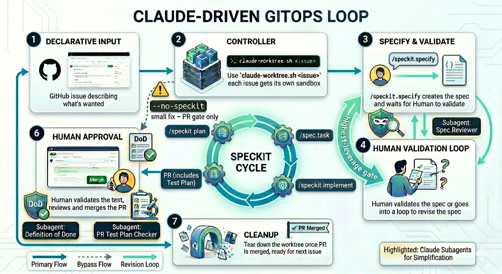

# Claude-Driven GitOps Workflow: From Issue to PR with Spec-Driven Development and Human-in-the-Loop

GitHub issues pile up faster than humans can work them. What if every issue could spin up its own isolated Claude session, one that reads the spec, writes the code, opens the PR, and cleans up after itself with a one-liner when the PR merges? That's exactly what a single shell script, `agent.sh`, allowed me to do on [RepoPulse](https://github.com/arun-gupta/repo-pulse).

This post walks through how the script composes five ideas (**git worktrees**, **Claude Code sessions**, **Spec-Driven Development**, **human-in-the-loop review**, and **lifecycle cleanup**) into a repeatable, Claude-driven GitOps loop. Toward the end it also covers **Claude Code sub-agents**: small, scoped helpers for checklist-style gates so the main session keeps a smaller context window.

## Claude-Driven GitOps

GitOps is "the repo is the source of truth; a controller reconciles the world to match it." Swap the controller out for Claude and the loop becomes:

- **Declarative input:** a GitHub issue describing what's wanted.
- **Controller:** a Claude session kicked off with that issue number.
- **Reconciliation:** a spec-driven lifecycle from design to PR.
- **Human approval:** PR review and merge.
- **Cleanup:** tear down the worktree once the PR is merged.

<p align="center">
  
</p>

The issue is the spec of the spec. Claude handles the rest, autonomously when you want, interactively when you need to steer.

## The One-Liner That Starts It All

```bash
scripts/agent.sh 212
```

That command does a surprising amount of work:

1. Uses `gh` to read issue **#212** and builds a short slug from the title (or pass your own slug as the second argument).
2. Creates a sibling worktree `../<repo-prefix>-212-<slug>` and a matching branch. The prefix is hardcoded in the script (e.g. `repo-pulse-`); edit it once if you fork the script into another repo.
3. Picks a free port, copies `.env.local` from the main checkout, runs `npm install`, and starts `npm run dev` in the background (`dev.log`).
4. Writes a `.agent` state file (agent name, session UUID, dev-server PID) and launches Claude with a kickoff prompt for that issue (add `--headless` to run in the background).

Each issue gets its own sandbox: its own working tree, its own port, its own dev server, its own Claude session. You can run three of these in parallel and they won't collide on ports, branches, or working trees.

## Spec-Driven Development, Not Vibe-Coding

The kickoff prompt the script sends to Claude isn't "go fix issue #212." It's a two-stage contract around the [SpecKit](https://github.com/github/spec-kit) lifecycle (condensed here; the real prompt also names the exact approval phrases (`"proceed"`, `"approved"`, or `"go to plan"`) and the revision-loop behavior):

```
STAGE 1: Run /speckit.specify. When it completes, report the spec
file path and STOP. Wait for explicit user approval.

STAGE 2: After approval, run /speckit.plan, then /speckit.tasks,
then /speckit.implement in sequence. Push the branch and open a PR.
```

This matters. Without SpecKit, you get a Claude that dives straight into code and justifies the design retroactively. With SpecKit, the session produces a written spec first (scope, acceptance criteria, out-of-scope boundaries), and only then plans, decomposes, and implements.

The spec is the highest-leverage artifact in the loop. Every downstream step compounds on it. If the spec is wrong, the plan is wrong, the tasks are wrong, the code is wrong. So the script makes the spec review a hard gate.

## Human-in-the-Loop, Without Babysitting

Spec approval is mandatory, but it's asynchronous. Headless mode is where this shines:

```bash
scripts/agent.sh --headless 212
```

Claude runs `/speckit.specify` in the background, writes the spec, logs to `agent.log`, and pauses. You review the spec on your own time: lunch, the next morning, whenever.

Approve it and Stage 2 runs unattended:

```bash
scripts/agent.sh --approve-spec 212
```

Or push back with specific feedback:

```bash
scripts/agent.sh --revise-spec 212 \
  "Add a constraint: results must stream; no full-page reloads."
```

Both commands resume the *exact* Claude session. The pre-generated session UUID stored in `.agent` makes that possible. No context is lost between approval and implementation. The revision path re-enters the pause, so you can iterate on the spec until you're happy, then release.

This is the sweet spot: humans review intent, Claude executes the mechanical stages. Batch three issues in the morning:

```bash
for i in 210 211 212; do
  scripts/agent.sh --headless "$i"
done
```

Review three specs at lunch:

```bash
for i in 210 211 212; do
  scripts/agent.sh --approve-spec "$i"
done
```

Come back to three open PRs.

## The Quick Path: `--no-speckit`

Sometimes you have a small, crisp issue: a typo, a config tweak, a one-line bugfix. The SpecKit lifecycle is overkill. That's what `--no-speckit` is for:

```bash
scripts/agent.sh --no-speckit 275
```

This skips the spec/plan/tasks stages entirely. Claude reads the issue, makes the changes, pushes the branch, and opens a PR. No review gate, no human-in-the-loop checkpoint.

The script is loud about this trade-off:

```
WARNING: --no-speckit skips the SpecKit lifecycle and the spec-review pause.
         This run is fully automated with NO human-in-the-loop checkpoint.
         The agent will make changes and open a PR without spec approval.
```

The PR review itself becomes your review gate. For small issues that's the right call. An approved spec for a one-line fix is ceremony, not quality.

## Cleanup Is a First-Class Operation

Worktrees accumulate. Branches linger. The script provides two cleanup paths, and the distinction matters:

**`--discard`** discards a worktree regardless of PR state. Use it when you abandoned the work, or Claude went down a wrong path and you want to start over. It removes the worktree and deletes the local and remote branch (prompts for `YES` confirmation):

```bash
scripts/agent.sh --discard 212
```

**`--cleanup-merged`** is the happy-path cleanup. It's careful:

```bash
scripts/agent.sh --cleanup-merged 212
```

It queries the GitHub PR state via `gh pr view`, not local ancestry, because squash and rebase merges produce a merge commit that isn't an ancestor of the local feature branch. Only when the PR is `MERGED` does it:

1. Verify the primary worktree is on `main`.
2. Pull `main` with `--ff-only`.
3. Kill the background dev server and Claude process.
4. Remove the worktree.
5. Delete the local branch.
6. Delete the remote branch (a no-op if GitHub's "auto-delete merged branches" already removed it).

That PR-state check is the detail that makes this safe in practice. "Is this branch merged into main?" is the wrong question when your merge strategy is squash. "Did GitHub mark this PR as merged?" is the right one.

## Why This Composition Works

Each piece is simple on its own. Git worktrees are ~20 years old. `gh` has shipped for years. Claude Code sessions are addressable by UUID. SpecKit is a set of slash commands. None of these is novel.

What's novel is the composition:

- **Worktree isolation** means parallel Claude sessions don't conflict.
- **Session UUIDs** make headless spawns addressable for approval and revision.
- **SpecKit staging** turns "go fix this" into a reviewable artifact before implementation.
- **The mandatory spec-approval gate** keeps human judgment exactly where it compounds: on intent, before downstream work.
- **PR-state-aware cleanup** closes the loop safely.

`--no-speckit` is the deliberate exception: small fixes skip the SpecKit stages but still hit the PR-review gate. The result is a GitOps loop where the reconciliation controller is an LLM, the declarative input is a GitHub issue, and the human stays in the loop at exactly one point (the spec), where their judgment matters most.

## How This Changed My Cadence

RepoPulse used to feel like every other solo checkout: one branch, one context, small fixes postponed and big work blocking everything else. Now I queue **several headless runs in parallel**, review specs when I have a slice of attention, reach for **`--no-speckit`** when the change is obviously tiny, and run **`--cleanup-merged`** after merge so branches and worktrees don't pile up.

The bottleneck moved from typing and context switches to **human-in-the-loop** work: spec approval, `--revise-spec` when intent is wrong, and PR review. That's because **judgment** is what I want to protect, not keystroke speed. The practical difference is how many issues I'm willing to *start*: things that used to wait weeks for a "free afternoon" now get a worktree and a spec within minutes of filing.

## Claude Code Sub-Agents

The worktree script isolates **repos**; **sub-agents** (small definitions under `.claude/agents/`) isolate **kinds of work**. [Issue #297](https://github.com/arun-gupta/repo-pulse/issues/297) tracks purpose-built agents for the SpecKit pause and PR discipline. For example, a read-only spec pass against the constitution, a Definition-of-Done punch list before you open a PR, and a test-plan checkbox audit, so narrow checklists do not inflate the main session’s transcript.

That keeps the implementation context window focused on design and code, while mechanical verification runs elsewhere (and can even use a __faster__ or __cheaper__ model when the task is classification and reporting, not greenfield reasoning). Same pipeline: humans still own approval and merge; sub-agents just make the boring gates cheap and repeatable.

## What's Next

Some possible extensions:

- [#279](https://github.com/arun-gupta/repo-pulse/issues/279): `--cleanup-all-merged` sweep for batch teardown.
- [#280](https://github.com/arun-gupta/repo-pulse/issues/280): `--status` command showing worktrees, PR state, and Claude session state.
- [#281](https://github.com/arun-gupta/repo-pulse/issues/281): GitHub Actions integration via a `claude-ready` label.

## Takeaway

The current script is already doing something interesting. It treats Claude not as a chatbot but as a controller in a GitOps loop, one that respects spec-driven discipline, honors human approval gates, and cleans up after itself.

The script is ~300 lines of bash (core) plus adapter plugins. You can read the whole thing in a few minutes. Go look: [`scripts/agent.sh`](https://github.com/arun-gupta/repo-pulse/blob/main/scripts/agent.sh).
