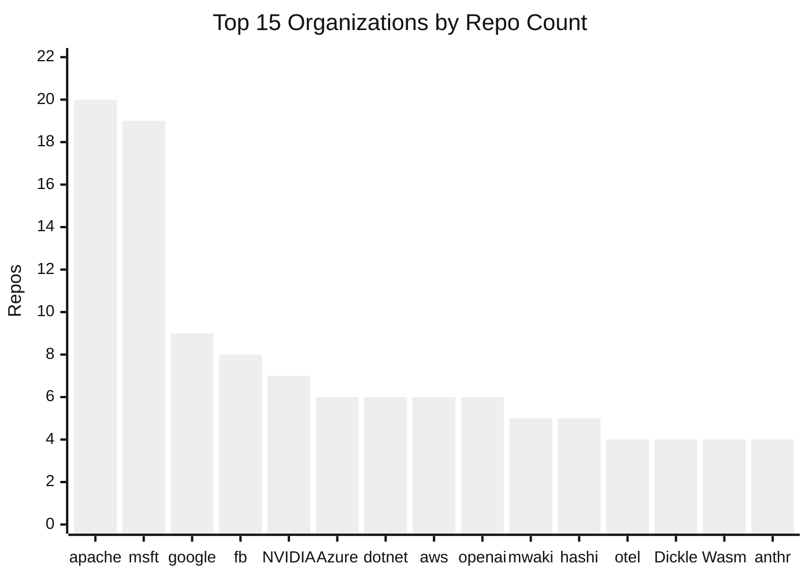

# Calibration Diversity Report

Generated: 2026-04-10

This report is auto-generated by `npm run calibrate:dry-run` to provide transparency into the composition of the calibration sample.

## Summary: 1604 repos · 1390 orgs · 152 languages · 4 brackets

### Sample size

| Bracket | Repos |
|---------|-------|
| Emerging (10–99 stars) | 400 |
| Growing (100–999 stars) | 400 |
| Established (1k–10k stars) | 400 |
| Popular (10k+ stars) | 404 |
| **Total** | **1604** |

### Organization diversity

**1390** unique organizations across all brackets.

### Strata targets

| Stratum | Emerging (10–99) | Growing (100–999) | Established (1k–10k) | Popular (10k+) |
|---------|-----------------|-------------------|---------------------|----------------|
| S1 | 118 (10–19) | 108 (100–199) | 108 (1k–2k) | 115 (10k–20k) |
| S2 | 102 (20–34) | 87 (200–349) | 87 (2k–3.5k) | 95 (20k–40k) |
| S3 | 92 (35–54) | 80 (350–549) | 80 (3.5k–5k) | 80 (40k–80k) |
| S4 | 88 (55–99) | 70 (550–749) | 70 (5k–7k) | 60 (80k–170k) |
| S5 | — | 55 (750–999) | 55 (7k–10k) | 40 (170k+) |
| **Total** | **400** | **400** | **400** | **390** |

**Why 4 vs 5 strata?** Emerging (10–99 stars) uses 4 strata because the range spans only 90 stars — a narrow range where a 5th stratum would create sub-ranges too small to be meaningful. Growing, Established, and Popular each span one or more orders of magnitude and use 5 strata for finer coverage.

**Why are strata targets unequal?** Targets are proportional to GitHub's population density within each range. Lower strata (e.g., 10–19 stars) have vastly more repos in the population than upper strata (e.g., 170k+ stars), so they receive higher targets. This ensures the sample reflects the natural distribution rather than over-representing the sparse high end. Some strata may fall short of target when language or organization diversity caps limit the available pool.

### Language diversity

Cap: 15 per bracket for popular languages (JavaScript, TypeScript, Python, Java, Go, Rust, C++, C#), 8 for others. Caps apply only to auto-sampled repos — manually curated repos are exempt (see note below).

### Sampling rules

- **Language cap**: 15 repos per bracket for popular languages, 8 for others *(auto-sampled only)*
- **Organization cap**: 5 repos per organization per bracket
- **Pushed within**: 12 months (rolling window computed at runtime)
- **Excluded**: forks, archived repos, profile READMEs, documentation sites, mirrors, collections/lists, bypass tools

> **Note on language cap exceptions:** Per-bracket language counts may exceed the 15/8 cap because ~120 manually curated repos (from CNCF, Apache, Eclipse, Mozilla, GNOME, HashiCorp, OpenAI, Anthropic, Mistral, Google, AWS, Microsoft, Netflix, LF Open Source Index, and GitHub top-100) are exempt from language caps. These repos were selected for their importance to the open source ecosystem, not by language. Enforcing caps on them would exclude significant projects (e.g., torvalds/linux, kubernetes/kubernetes) solely to satisfy an artificial distribution constraint. Language caps remain enforced during auto-sampling to prevent any single language from dominating the sample.

### Language distribution by bracket

**152** unique languages across all brackets (93 Emerging · 88 Growing · 91 Established · 61 Popular).

| Language | Emerging | Growing | Established | Popular | **Total** |
|----------|----------|---------|-------------|---------|-----------|
| Python | 27 | 27 | 29 | 54 | **137** |
| TypeScript | 28 | 24 | 24 | 51 | **127** |
| Go | 16 | 20 | 18 | 51 | **105** |
| C++ | 16 | 20 | 21 | 31 | **88** |
| Java | 16 | 16 | 21 | 29 | **82** |
| JavaScript | 21 | 17 | 17 | 26 | **81** |
| Rust | 18 | 19 | 19 | 21 | **77** |
| C# | 17 | 13 | 16 | 8 | **54** |
| C | 7 | 10 | 10 | 18 | **45** |
| Kotlin | 10 | 9 | 8 | 7 | **34** |
| Shell | 8 | 12 | 7 | 7 | **34** |
| Ruby | 7 | 8 | 10 | 9 | **34** |
| PHP | 9 | 8 | 9 | 7 | **33** |
| Lua | 8 | 8 | 8 | 7 | **31** |
| Swift | 7 | 7 | 10 | 7 | **31** |

---

## Emerging (10–99 stars) (400 repos)

### Organization diversity

- **392** unique organizations
- **387** single-repo orgs
- **5** orgs with 2+ repos:
  - mwakidenis: 5
  - microsoft: 2
  - Xor-el: 2
  - nuuuwan: 2
  - Bd-Mutant7: 2

## Growing (100–999 stars) (400 repos)

### Organization diversity

- **387** unique organizations
- **377** single-repo orgs
- **10** orgs with 2+ repos:
  - ROCm: 3
  - Azure: 3
  - AdaCore: 3
  - SonarSource: 2
  - NVIDIA: 2
  - REIJI007: 2
  - Dicklesworthstone: 2
  - Alchyr: 2
  - selenide-examples: 2
  - terraform-google-modules: 2

## Established (1k–10k stars) (400 repos)

### Organization diversity

- **363** unique organizations
- **340** single-repo orgs
- **23** orgs with 2+ repos:
  - microsoft: 7
  - apache: 6
  - WebAssembly: 4
  - frappe: 3
  - NVIDIA: 3
  - parse-community: 3
  - google: 2
  - ScoopInstaller: 2
  - stripe: 2
  - symfony: 2
  - nix-community: 2
  - open-telemetry: 2
  - w3c: 2
  - python: 2
  - facebook: 2
  - googleapis: 2
  - Dicklesworthstone: 2
  - GoogleCloudPlatform: 2
  - dotnet: 2
  - kristoff-it: 2
  - OWASP: 2
  - swiftlang: 2
  - Azure: 2

## Popular (10k+ stars) (404 repos)

### Organization diversity

- **332** unique organizations
- **304** single-repo orgs
- **28** orgs with 2+ repos:
  - apache: 13
  - microsoft: 9
  - google: 7
  - openai: 6
  - aws: 5
  - facebook: 5
  - hashicorp: 5
  - huggingface: 4
  - Homebrew: 3
  - anthropics: 3
  - mistralai: 3
  - GNOME: 3
  - Netflix: 3
  - dotnet: 3
  - JetBrains: 2
  - swiftlang: 2
  - docker: 2
  - grafana: 2
  - actions: 2
  - neovim: 2
  - mozilla: 2
  - influxdata: 2
  - ansible: 2
  - PaddlePaddle: 2
  - vercel: 2
  - alibaba: 2
  - material-components: 2
  - NVIDIA: 2

