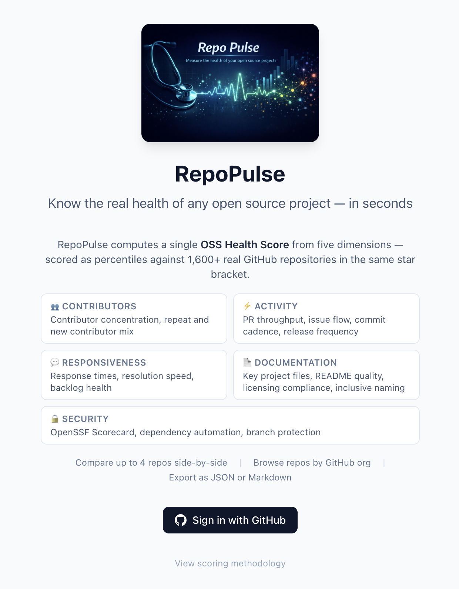
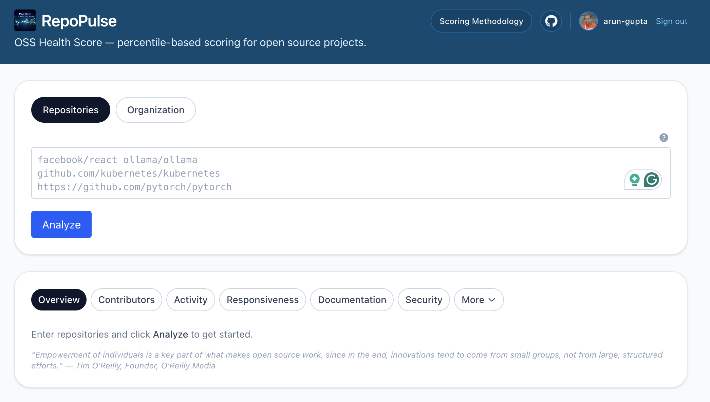
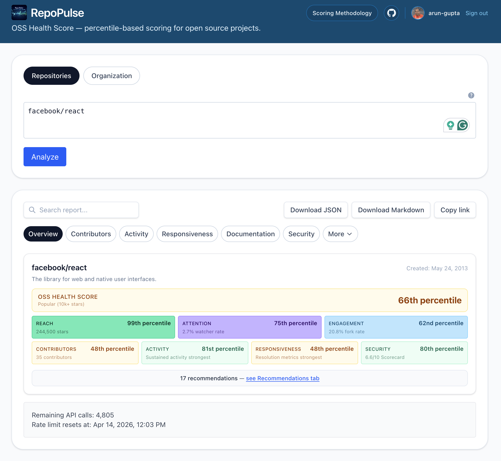
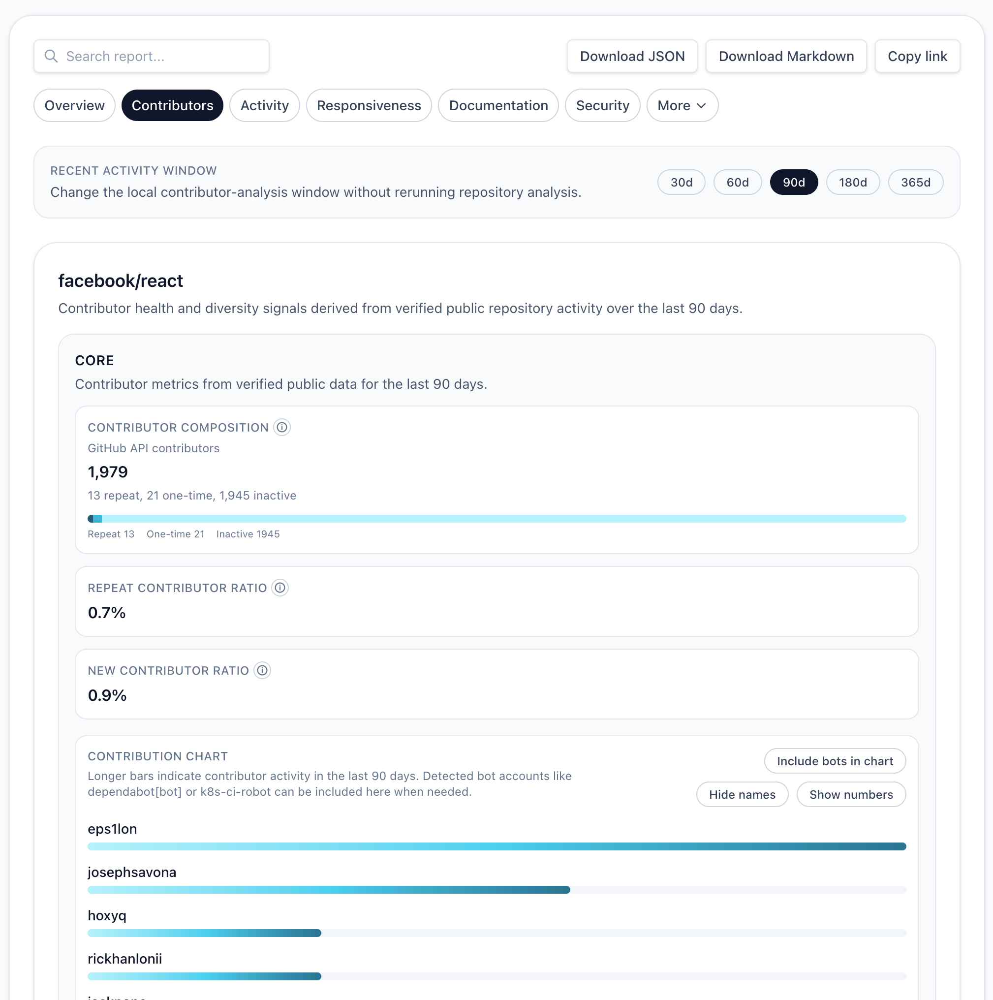
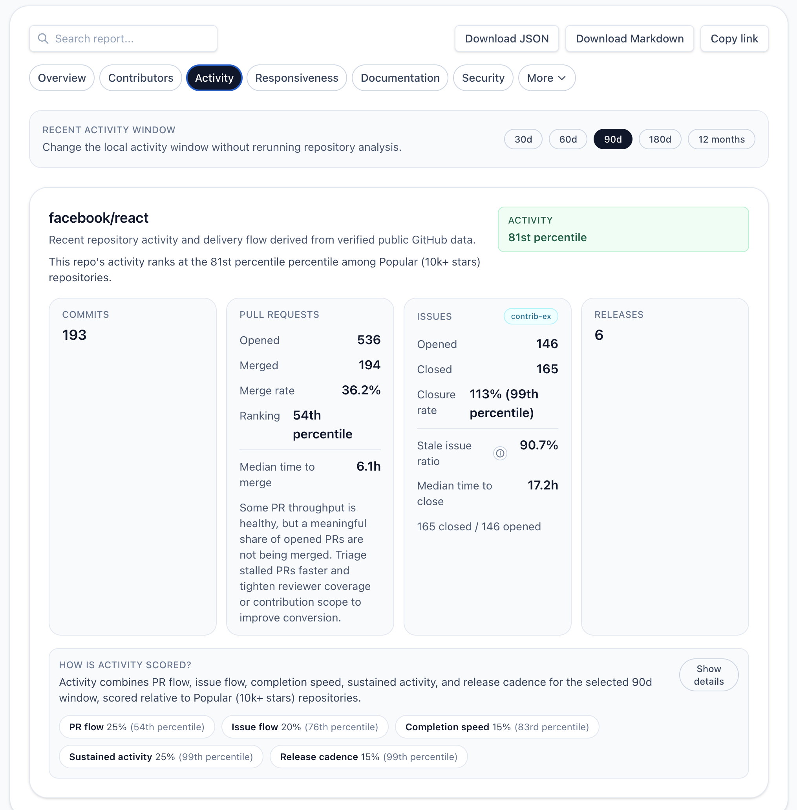
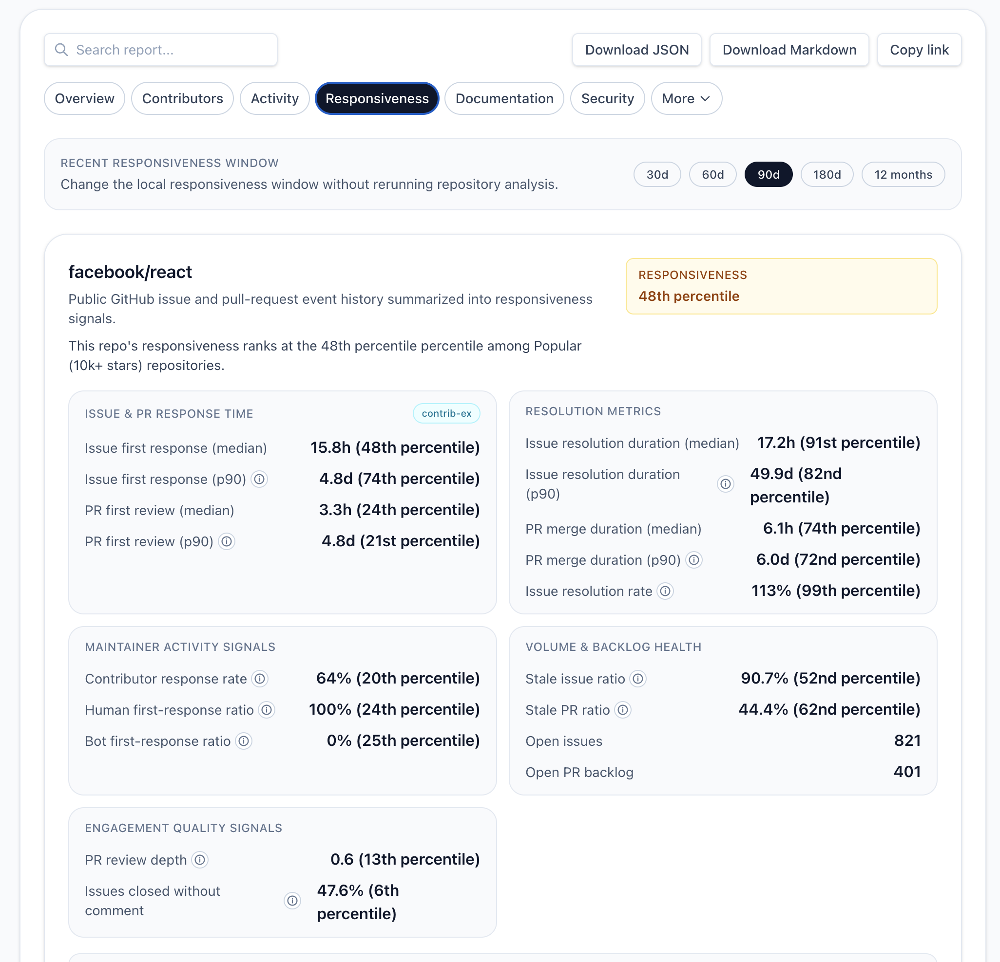
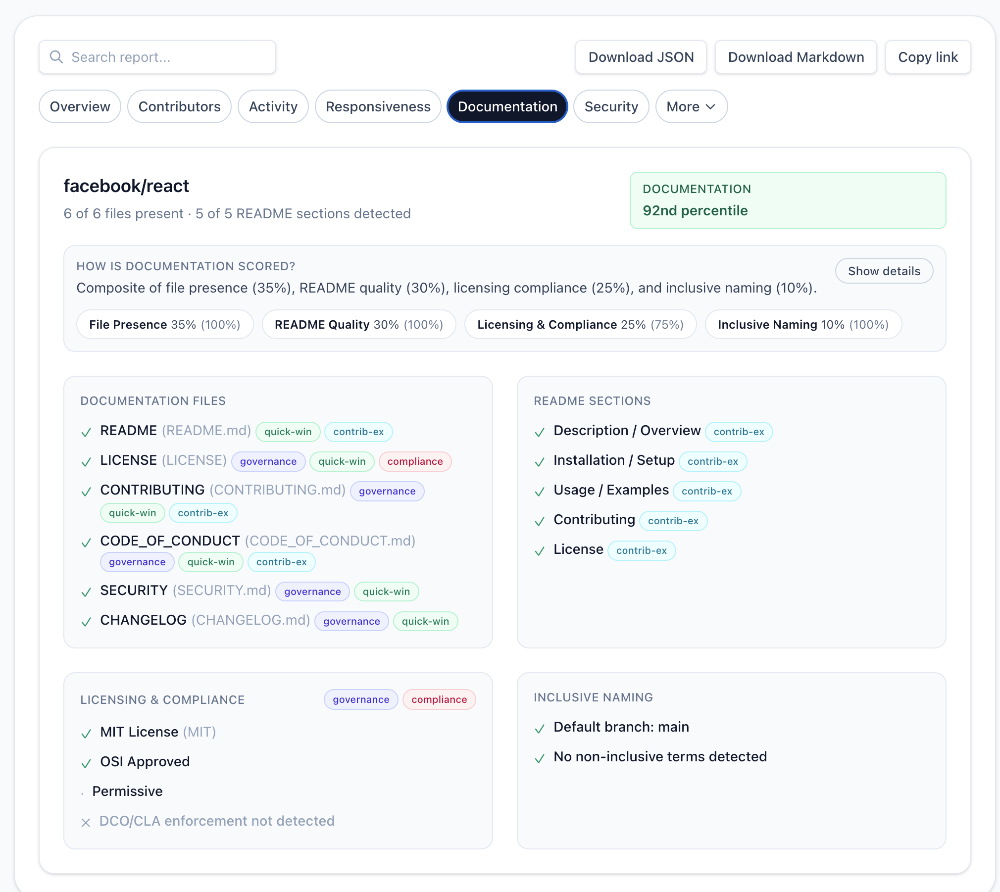
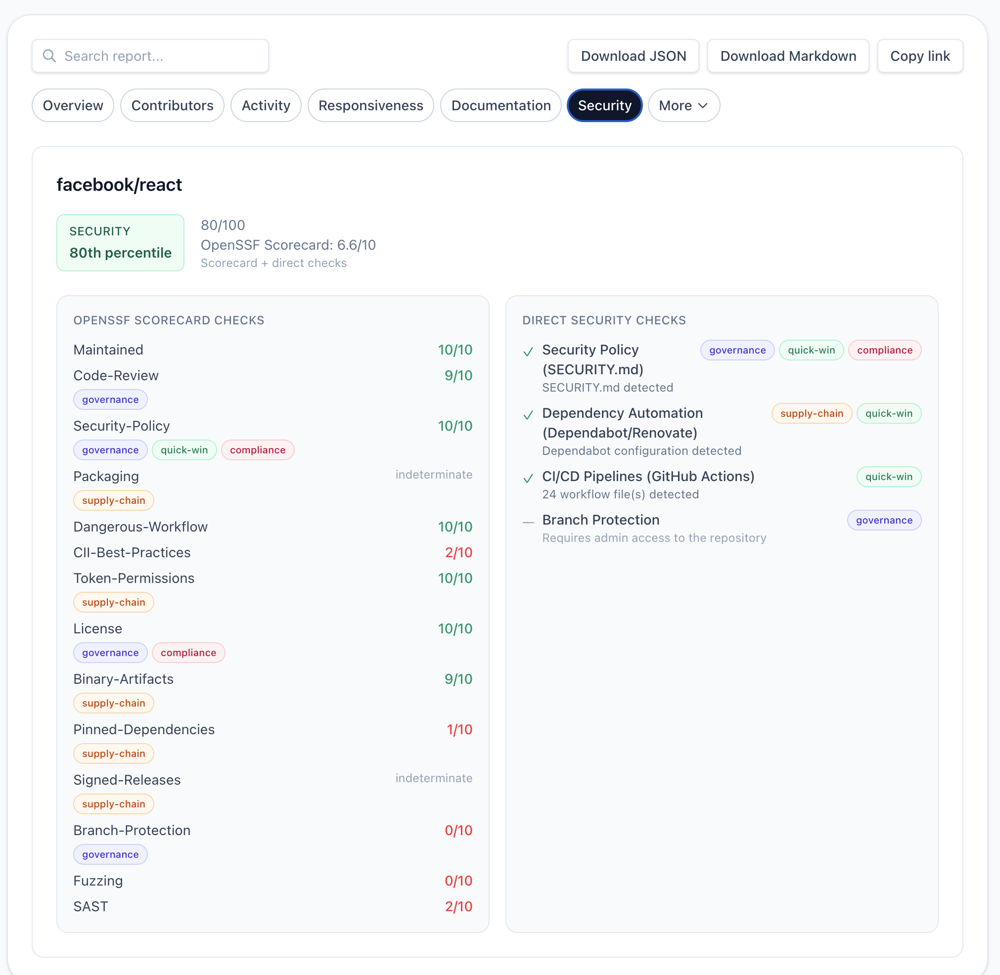
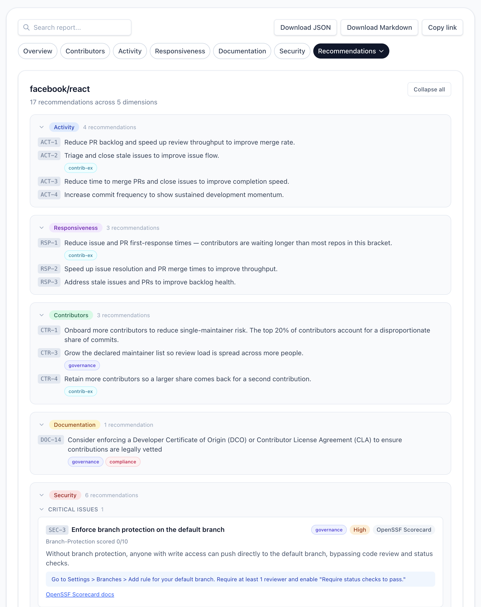
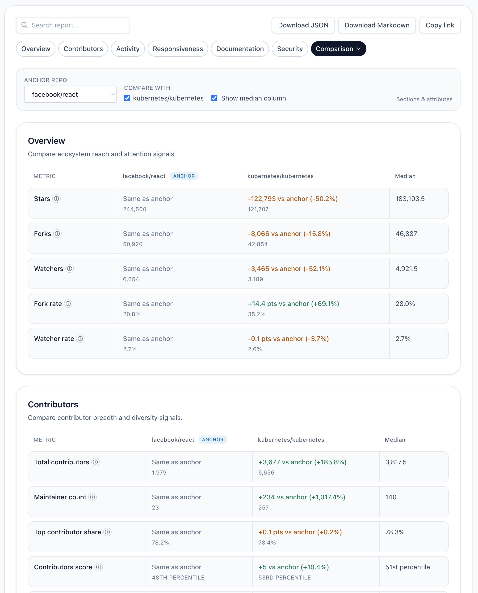

# Beyond Stars and Forks: 42 Ways to Measure and Improve Open Source Health

**Contents**

- [Introduction](#introduction)
- [Dimensions](#dimensions)
  - [Contributors (23% of Health Score)](#contributors-23-of-health-score)
  - [Activity (25% of Health Score)](#activity-25-of-health-score)
  - [Responsiveness (25% of Health Score)](#responsiveness-25-of-health-score)
  - [Documentation (12% of Health Score)](#documentation-12-of-health-score)
  - [Security (15% of Health Score)](#security-15-of-health-score)
- [Beyond the Score: Ecosystem Profile](#beyond-the-score-ecosystem-profile)
- [How recommendations work](#how-recommendations-work)
- [Comparison](#comparison)
- [The Scoring Framework](#the-scoring-framework)
- [How the Calibration Works](#how-the-calibration-works)
- [How This Was Built](#how-this-was-built)
- [A note on prior art](#a-note-on-prior-art)
- [Contribute to RepoPulse](#contribute-to-repopulse)

## Introduction

Measuring open source health is harder than scanning a README. A few of the top challenges:

- **Vanity metrics dominate** — Stars and forks mostly measure attention. They do not tell you whether PRs merge, issues get answers, or releases keep pace with demand.
- **Context matters** — The same raw numbers mean different things for a small utility and a widely depended-on framework; comparisons need peers, not one-size-fits-all cutoffs.
- **Health is multidimensional** — Activity, responsiveness, **Contributors** (read through a sustainability lens), documentation, and security overlap but are not interchangeable; collapsing them without structure hides tradeoffs.
- **Trust requires transparency** — Any score is only useful if people can see what it is built from and what was left out because the data is not publicly verifiable.

[RepoPulse](https://repopulse-arun-gupta.vercel.app) tackles those constraints directly: it analyzes a public GitHub repository and returns a composite **OSS Health Score** — percentile-based, calibrated against 1,600+ repositories, with dimensions and recommendations tied to explicit signals.

You log in using your GitHub to get started to see this page:

You enter a repo and click on Analyze to get full results. The Overview tab provides a quick snapshot across the dimensions:

In the screenshot above, the tabs map directly to the five health dimensions this article explains.

RepoPulse draws heavily from the [CHAOSS project](https://chaoss.community/) metrics as inspiration, adapting them into a calibrated, percentile-based scoring system with actionable outputs.

Alongside the score, RepoPulse provides **detailed, actionable recommendations** — so teams can move from “where do we rank?” to “what should we fix next?”

**Screenshots:** Overview, recommendations, and each dimension tab were captured while analyzing [**facebook/react**](https://github.com/facebook/react) in RepoPulse. The **[Comparison](#comparison)** example uses **facebook/react** as the anchor repo alongside [**kubernetes/kubernetes**](https://github.com/kubernetes/kubernetes).

Below are 42 signals RepoPulse uses today to measure open source health — and what you can do about each one. More signals are on the way.

**Quick read on scoring:** Each dimension is a **percentile (0–99)** against peer repositories in the same **star bracket**, not against all of GitHub. The headline **OSS Health Score** is a **weighted blend** of those dimensions. Bracket boundaries, composite weights, lookback windows, comparison, exports, and calibration are in **[The Scoring Framework](#the-scoring-framework)** and **[How the Calibration Works](#how-the-calibration-works)** below. Sub-factor weights for each dimension are given in that dimension’s section.

---

## Dimensions

The subsections below follow the same order as RepoPulse’s in-app tabs—**Contributors**, **Activity**, **Responsiveness**, **Documentation**, and **Security**. Each one lists the signals that feed that dimension’s percentile and the kinds of recommendations you might see there.

### Contributors (23% of Health Score)

**Contributors** measures who shows up and who keeps showing up—through a **sustainability** lens: can the project keep operating if key people leave, and is the workload spread across more than one person or organization?

**1. Contributor Concentration** — What percentage of total commits come from the top 20% of contributors? High concentration = high bus factor risk.

**2. Total Contributor Count** — More contributors generally means more resilience, but only if contributions are distributed.

**3. Repeat Contributor Ratio** — Are contributors coming back? One-time contributors don't build institutional knowledge.

**4. New Contributor Ratio** — Is the project attracting fresh talent, or is the contributor pipeline drying up?

**5. Maintainer Depth** — How many maintainers are declared in `CODEOWNERS`, `MAINTAINERS`, `OWNERS`, or `GOVERNANCE.md`? A wider declared team spreads review load and reduces single-person risk.

**6. Contribution Breadth** — Is the project seeing all three kinds of contribution activity (commits, pull requests, and issues) recently, or only one? Breadth signals a living project with multiple ways to engage.

**How the score is weighted in this dimension:** Contributors is a weighted blend of five sub-factors: **Contributor concentration (40%)**, **Maintainer depth (20%)**, **Repeat contributors (20%)**, **Contribution breadth (10%)**, and **New contributors (10%)**. Concentration — the share of commits attributed to the top 20% of contributors — remains the largest signal, but maintainer depth, repeat-contributor retention, and the spread of contribution types (commits, PRs, issues) now factor directly into the score. Concentration is calibrated against the peer bracket; the other four sub-factors use linear approximations today pending a calibration refresh.

It also provides a heatmap of contributors with optional names of each contributor and total number of commits. It also does a best effort estimation of single-vendor dependency ratio and organization contribution chart.

**Example recommendations you might see in this dimension:**

- **`CTR-1`** — Onboard more contributors to reduce single-maintainer risk
- **`CTR-2`** — Add a CODEOWNERS or MAINTAINERS.md file
- **`CTR-3`** — Grow the declared maintainer list to spread review load
- **`CTR-4`** — Retain contributors so more of them come back for a second contribution

---

### Activity (25% of Health Score)

Activity measures whether your project has a pulse — are PRs moving, issues closing, and releases shipping?

**7. PR Merge Rate** — What percentage of opened PRs actually get merged? A low rate signals review bottlenecks or contributor friction.

**8. Issue Closure Rate** — Are issues getting resolved, or is your tracker a graveyard? Track closed-to-opened ratio across time windows.

**9. Stale Issue Ratio** — What fraction of open issues have gone cold? Stale issues discourage new contributors who wonder if anyone's home.

**10. Median Time to Merge PRs** — How many hours (or days) does a contributor wait for their PR to land? Speed here directly impacts contributor retention.

**11. Median Time to Close Issues** — Similar signal for issues. Faster resolution = healthier project perception.

**12. Commit Frequency (30/90/180 day windows)** — Sustained commits across multiple time windows reveal whether activity is consistent or comes in bursts.

**13. Release Cadence** — How often do you cut releases? Regular releases signal maturity and give users confidence they're running supported software.

**How the score is weighted in this dimension:** Activity is a weighted blend of five factors: **PR flow (25%)**, **Issue flow (20%)**, **Completion speed (15%)**, **Sustained activity (25%)**, and **Release cadence (15%)**.

**Example recommendations you might see in this dimension:**

- **`ACT-1`** — Reduce PR backlog and speed up review throughput
- **`ACT-2`** — Triage and close stale issues
- **`ACT-3`** — Reduce time to merge PRs and close issues
- **`ACT-4`** — Increase commit frequency for sustained momentum

---

### Responsiveness (25% of Health Score)

Responsiveness measures how quickly maintainers engage with their community. This is often the dimension that separates thriving projects from abandoned ones.

**14. Issue First-Response Time (Median)** — How long until someone — anyone — acknowledges a new issue? Even a "thanks, we'll look into this" matters.

**15. Issue First-Response Time (P90)** — The median hides outliers. P90 reveals your worst-case scenario — those issues that sat for weeks untouched.

**16. PR First-Review Time (Median)** — Contributors invest significant effort in PRs. How quickly do you provide initial feedback?

**17. PR First-Review Time (P90)** — Again, worst-case matters. A 2-day median with a 30-day P90 means some contributors are having a terrible experience.

**18. Issue Resolution Duration** — From open to close — how long does the full lifecycle take? Tracked as both median and P90 so tail issues don't hide behind a healthy median.

**19. PR Merge Duration** — From open to merge — the contributor's total wait time. Tracked as both median and P90.

**20. Issue Resolution Rate** — What percentage of issues actually reach resolution?

**21. Contributor Response Rate** — What share of issues and PRs receive *any* maintainer response?

**22. Human vs. Bot Response Ratio** — Bots are great for triage, but if 95% of first responses are automated and humans never follow up, that's a red flag.

**23. Stale PR Ratio** — Open PRs that have gone cold signal abandoned contributor effort.

**24. PR Review Depth** — Average reviews/comments per merged PR. More depth = more thorough code review culture.

**25. Issues Closed Without Comment** — Closing issues silently (no explanation, no engagement) erodes community trust.

**How the score is weighted in this dimension:** Responsiveness combines five categories: **Issue & PR response time (30%)**, **Resolution metrics (25%)**, **Maintainer activity signals (15%)**, **Volume & backlog health (15%)**, and **Engagement quality signals (15%)**. Inside categories, multiple underlying metrics are averaged (for example, response time blends issue/PR median and p90 behavior).

**Example recommendations you might see in this dimension:**

- **`RSP-1`** — Reduce issue and PR first-response times
- **`RSP-2`** — Speed up issue resolution and PR merge times
- **`RSP-3`** — Address stale issues and PRs

---

### Documentation (12% of Health Score)

Documentation is the front door of your project. Bad docs don't just frustrate users — they actively repel potential contributors.

**26. README Present** — Surprisingly, some projects still lack a proper README. It's the single most important file in your repository.

**27. LICENSE File** — No license = no legal clarity. Contributors and enterprises can't use your code without one.

**28. CONTRIBUTING.md** — Tell people how to contribute. Remove the guesswork.

**29. CODE_OF_CONDUCT.md** — Sets community expectations. Required by many organizations before they'll allow employee contributions.

**30. SECURITY.md** — How should someone report a vulnerability? Without this, security issues end up as public GitHub issues.

**31. CHANGELOG.md** — Users need to know what changed between versions.

**32. README Quality Score** — RepoPulse checks for 5 critical README sections: project description, installation instructions, usage examples, contributing guidelines, and license information.

**33. License Type & OSI Approval** — Is your license recognized? OSI-approved? RepoPulse classifies licenses into permissiveness tiers (Permissive, Weak Copyleft, Copyleft).

**34. DCO/CLA Enforcement** — Does your project require a Developer Certificate of Origin or Contributor License Agreement? Important for IP hygiene and enterprise adoption.

**35. Inclusive Naming** — RepoPulse checks default branch names and repository metadata against inclusive naming guidelines, with severity-tiered findings and replacement suggestions.

RepoPulse’s inclusive-naming suggestions are informed by guidance from the [Inclusive Naming Initiative](https://inclusivenaming.org/), which maintains practical naming recommendations and tooling patterns adopted across the industry.

**How the score is weighted in this dimension:** RepoPulse splits the Documentation score into four categories, then combines them into a composite:

- **File presence (35%)**: Weighted presence of key repo docs (README 30%, CONTRIBUTING 20%, SECURITY 20%, CHANGELOG 20%, CODE_OF_CONDUCT 10%). The `LICENSE` file is intentionally *not* counted here.
- **README quality (30%)**: Weighted coverage of README sections (description 25%, installation 25%, usage 25%, contributing 15%, license section 10%).
- **Licensing (25%)**: License present (40%), OSI-approved (25%), license tier classified (10%), and DCO/CLA enforcement (25%).
- **Inclusive naming (10%)**: Inclusive naming findings are scored separately and then folded into Documentation as the final 10%.

**Example recommendations you might see in this dimension:**

- **`DOC-1`** — Add a README
- **`DOC-3`** — Add CONTRIBUTING.md
- **`DOC-5`** — Add SECURITY.md
- **`DOC-6`** — Add CHANGELOG.md
- **`DOC-14`** — Enforce a DCO or CLA for contributions

---

### Security (15% of Health Score)

Supply chain security is no longer optional. RepoPulse integrates with the **OpenSSF Scorecard** (17 checks) and runs 4 direct repository checks.

**36. Branch Protection** — Is your default branch protected against force pushes and direct commits?

**37. Code Review Requirements** — Are PRs required to have reviews before merging?

**38. Dependency Update Automation** — Is Dependabot (or equivalent) enabled? Outdated dependencies are the #1 attack vector.

**39. Security Policy** — Does SECURITY.md exist with vulnerability disclosure instructions?

**40. CI/CD Pipeline** — Are automated tests running on PRs? This is the baseline for code quality.

**41. Token Permissions** — Are GitHub Actions workflows using least-privilege token scopes?

**42. Signed Releases & Artifact Provenance** — Can users verify that release artifacts actually came from your build pipeline?

**How the score is weighted in this dimension:** When Scorecard data is available, Security is a composite of **Scorecard (60%)** and **direct checks (40%)**. The direct-check portion is weighted across: **Dependabot (35%)**, **Branch protection (30%)**, **CI/CD (25%)**, and **SECURITY.md (10%)**. When Scorecard is unavailable, RepoPulse falls back to direct checks only, with weights rebalanced (**30/30/20/20** across SECURITY.md, Dependabot, CI/CD, branch protection).

**Example recommendations you might see in this dimension:**

- **`SEC-3`** — Enforce branch protection on the default branch
- **`SEC-5`** — Require code review before merging pull requests
- **`SEC-6`** — Enable automated dependency updates
- **`SEC-7`** — Sign release artifacts to attest provenance
- **`SEC-8`** — Restrict GitHub Actions token permissions

---

## Beyond the Score: Ecosystem Profile

RepoPulse also surfaces 3 **ecosystem health ratios** that sit alongside your health score (but don't factor into it):

- **Reach** — Star count percentile (how visible is your project?)
- **Attention** — Watcher-to-star ratio (are people actively following updates?)
- **Engagement** — Fork-to-star ratio (are people building on your work?)

These help you understand your project's *position* in the ecosystem, separate from its operational health.

---

## How recommendations work

Each of the five scored dimensions above surfaces a short list of example recommendation IDs. This is the system behind them.

Every recommendation is tied to a specific dimension and maps back to a concrete action that can be taken. Recommendations use **stable reference IDs** (for example, `CTR-2` or `SEC-6`) so you can reference them in issues, reports, and discussions and track them over time.

Each of the 42 recommendations in the catalog is also tagged with one or more **cross-cutting categories**, so you can filter by the kind of work you want to focus on:

- **Governance** — Structural project health
- **Supply Chain** — Artifact and dependency integrity
- **Quick Win** — Fixable in under an hour
- **Compliance** — Legal and policy requirements
- **Contributor Experience** — Making it easier for others to participate

---

## Comparison

After you analyze repositories in the same session (up to **four**), open the **Comparison** tab to line them up side by side. Pick an **anchor** repo as the baseline, then choose which other analyzed repos to compare against it. Turn on **Show median column** to show the calibrated baseline median beside the anchor and comparison values for each metric.

Tables are grouped the same way as the rest of the report (for example **Overview** ecosystem signals and **Contributors** health metrics). Each row shows the anchor value, the comparison repo value or delta, and optional median—handy for “us vs. them” without re-running analysis.

You can still use **Download JSON**, **Download Markdown**, and **Copy link** from the top bar to share or archive a comparison session.

---

## The Scoring Framework

RepoPulse evaluates projects across **5 health dimensions** (more coming), each producing a percentile score (0-99) relative to repositories in the same size bracket. Your project isn't compared against Kubernetes if you have 200 stars — it's compared against peers.

The repos are divided in 4 brackets based upon number of stars:

| Bracket | Stars |
|---|---:|
| **Emerging** | 10-99 stars |
| **Growing** | 100-999 |
| **Established** | 1K-10K |
| **Popular** | 10K+ |

Each repo is evaluated across these health **dimensions**; each contributes the following share of the composite OSS health score. The numbered signals and sub-factor splits for each dimension are defined in that dimension’s section earlier in this article.

| Dimension | Weight |
|---|---:|
| **Contributors** | 23% |
| **Activity** | 25% |
| **Responsiveness** | 25% |
| **Documentation** | 12% |
| **Security** | 15% |

**Multi-repo comparison.** Up to **four repositories** can be analyzed in a single session; every dimension and signal above is computed per repo. The **Comparison** tab turns that into side-by-side tables and deltas—see **[Comparison](#comparison)** for how to use it and an example screenshot.

**Configurable analysis window.** The Contributors, Activity, and Responsiveness dimensions all accept a **lookback window** that the user can switch between **30, 60, 90, 180, or 365 days (12 months)**. The default is 90 days. Shorter windows surface recent health; longer windows smooth out noise and reveal longer-term patterns. Switching windows recomputes the corresponding dimension score locally without re-running repository analysis.

**Calibration (high level):** Scores are percentiles within a bracket, using **strata** across the star range and **diversity caps** so the baseline is not dominated by one language or organization. Step-by-step detail is in **[How the Calibration Works](#how-the-calibration-works)** and in [Scoring and calibration](../scoring-and-calibration.md) / [Calibration diversity](../calibrate-diversity.md).

---

## How the Calibration Works

This section expands on **strata** and **diversity caps** from [The Scoring Framework](#the-scoring-framework).

RepoPulse does not use arbitrary "good/bad" thresholds. Every score is a **percentile ranking** against 1,600+ calibrated GitHub repositories. Filters, sort strategy, and stratum boundaries are documented in [Scoring and calibration](../scoring-and-calibration.md); bracket-level language and organization mix is in [Calibration diversity](../calibrate-diversity.md). Comparisons are layered so percentiles stay interpretable:

- **Star bracket** — You are ranked against similar-sized projects, not the whole of GitHub.
- **Strata within the bracket** — Each bracket is split into sub-ranges (with linear or log boundaries depending on scale). Targets are drawn per stratum so skewed star distributions do not collapse the baseline to “only the crowded low end.”
- **Language diversity** — Tiered per-language caps per bracket (15 repos each for JavaScript, TypeScript, Python, Java, Go, Rust, C++, and C#; 8 for any other primary language), reflecting GitHub’s mix while capping dominance by one ecosystem.
- **Organization diversity** — At most five repos per owning organization per bracket, so a few orgs cannot steer the baseline alone.
- **Quality filters** — No forks, no archived repos, active in the last 12 months, plus additional client-side filters described in [Scoring and calibration](../scoring-and-calibration.md).

Percentile anchors (p25, p50, p75, p90) will be refreshed quarterly. This means a "75th percentile" Activity score genuinely means you're more active than 75% of similar projects — not that you hit some arbitrary number.

---

## How This Was Built

**Technology stack.** RepoPulse is a **Next.js** (App Router) app in **TypeScript** with **Tailwind CSS**, deployed to **Vercel**. It is stateless by design — no database, no persistent user state. GitHub data comes via the **GraphQL API** with precise field selection to stay fast and rate-limit-friendly. Tests use **Vitest** + **React Testing Library** for units and **Playwright** for end-to-end.

**AI-assisted development.** The project was built with **Claude Code** and **OpenAI Codex** as AI coding assistants, with **VS Code** for code review. Every scoring algorithm, UI component, calibration pipeline, and test was written through human–AI collaboration — proving that AI-assisted development can produce production-grade open source tooling.

**Specification-Driven Development (SpecKit).** Non-trivial features follow a [SpecKit](https://github.com/github/spec-kit) loop: `/speckit.specify` → `/speckit.plan` → `/speckit.tasks` → `/speckit.implement`. The spec captures *what* and *why*; SpecKit generates TypeScript contracts (interfaces, view props, data-flow shapes) as the *how*. Each feature lands in `specs/NNN-feature-name/` with a manual-testing checklist that has to be signed off before the PR opens.

**Governance layer.** Two in-repo documents keep intent and execution aligned:

- **[`docs/PRODUCT.md`](../PRODUCT.md)** is the canonical product definition — architecture, API contract, accuracy policy, and feature specs. Phase 1 specs are frozen here as shipped. Phase 2+ features live in GitHub issues and are summarized in PRODUCT.md as link tables, so the active requirements discussion stays on the issues where people actually talk.
- **[`docs/DEVELOPMENT.md`](../DEVELOPMENT.md)** is the implementation ordering and Definition of Done — phase-by-phase feature-order tables, the SpecKit feature loop, PR merge rules, and checklist expectations.

The split worked well: PRODUCT.md answers "what and why," DEVELOPMENT.md answers "in what order and to what bar," and SpecKit specs under `specs/NNN-*/` are the concrete technical contracts generated from those two. Keeping Phase 2+ acceptance criteria in GitHub issues (rather than duplicating them in PRODUCT.md) also removed a surprising amount of spec drift as the project grew.

---

## A note on prior art

RepoPulse started as a way to systematize the open-source guidance I'd been giving to several companies — turning a stack of "you should look at X, Y, Z" advice into something more clinical and reproducible. Once I had an early version out for feedback, others pointed me at a couple of established tools in the same space: the [LFX Insights OSS Index](https://insights.linuxfoundation.org/) and [OSS Compass](https://oss-compass.org/). There is meaningful overlap with what I'd built, but enough genuine differentiation in each direction that all three felt worth keeping.

Both products cover real ground that RepoPulse doesn't. LFX surfaces quarterly contributor retention curves, geographic contributor breakdowns, outside-work-hours analysis, package download trends, downstream dependents, and long-range time-series history. OSS Compass takes a different cut — a three-axis framework (Productivity, Robustness, Niche Creation), persona-based contributor classifications (Casual / Regular / Core), an explicit Bus Factor metric, organization-level activity scoring as a separate model, and an Open Source Selection Evaluation surface for finding alternative projects. Spending time with both set a useful bar.

A few choices in RepoPulse emerged along the way that felt worth noting — not because RepoPulse does more (it doesn't, in aggregate), but because the trade-offs are different for a single-developer, advising-driven project:

- **Bracket-calibrated percentiles.** A 200-star project is ranked against 100–999-star peers, not against the whole of GitHub. I wanted scores that weren't quietly punitive for small projects.
- **Stable recommendation IDs** (`CTR-2`, `SEC-6`, `DOC-3`, …). Every recommendation has an ID you can cite in a PR title, a commit message, or an issue. Building the catalog taught me to care a lot about ID discipline — no silent drift, no duplicates.
- **"Insufficient verified public data" as an explicit state.** If a field can't be verified against the GitHub API, RepoPulse marks it missing rather than estimating. Honoring that honestly was harder than I expected.
- **Inclusive naming as a first-class check** — branch and metadata scanning with severity tiers and replacement suggestions, not just a side mention in documentation.
- **Configurable analysis window** (30 / 60 / 90 / 180 / 365 days) with local recomputation. Switching a window doesn't re-fetch anything — it just recomputes from the snapshot in memory.
- **Up to four-repo comparison with JSON and Markdown exports.** The export surface forced the analyzer to stay pure and stateless.

None of this is meant as "better than" — LFX Insights and OSS Compass are mature products with much bigger surface areas, and RepoPulse is a focused tool that grew out of specific advising needs. If you're thinking through how to measure open-source health, spending time with all three is worthwhile.

---

## Contribute to RepoPulse

RepoPulse is open source (Next.js, TypeScript, Tailwind CSS) and actively looking for contributors. **Try it live:** [repopulse-arun-gupta.vercel.app](https://repopulse-arun-gupta.vercel.app) · **Source and releases:** [github.com/arun-gupta/repo-pulse](https://github.com/arun-gupta/repo-pulse)

Here are some ways to get involved:

**Good first issues** — perfect for your first contribution:
- Add a SECURITY.md ([issue #114](https://github.com/arun-gupta/repo-pulse/issues/114))
- Add a CODE_OF_CONDUCT.md ([issue #113](https://github.com/arun-gupta/repo-pulse/issues/113))
- Add a cancel/stop button to abort analysis ([issue #105](https://github.com/arun-gupta/repo-pulse/issues/105))

**Feature work** — for contributors looking for a deeper challenge:
- Public REST API for OSS Health Score ([issue #120](https://github.com/arun-gupta/repo-pulse/issues/120))
- Foundation-aware recommendations for CNCF, Apache, Linux Foundation projects ([issue #119](https://github.com/arun-gupta/repo-pulse/issues/119))
- Ecosystem Reach scoring ([issue #118](https://github.com/arun-gupta/repo-pulse/issues/118))
- Accessibility & Onboarding scoring ([issue #117](https://github.com/arun-gupta/repo-pulse/issues/117))
- Advanced documentation detection — API docs, architecture docs, Getting Started guide ([issue #110](https://github.com/arun-gupta/repo-pulse/issues/110))
- Maintainer best practices audit — inside-out repo analysis ([issue #99](https://github.com/arun-gupta/repo-pulse/issues/99))

Check out the [full issue list](https://github.com/arun-gupta/repo-pulse/issues) for more opportunities.

---

*What dimension of open source health do you find hardest to maintain? Running RepoPulse on your own repositories is a quick way to see how intuition lines up with percentile-backed signals.*

#OpenSource #DevTools #GitHub #SoftwareEngineering #OpenSourceHealth #CHAOSS #SupplyChainSecurity #DeveloperExperience #ClaudeCode #AICoding
